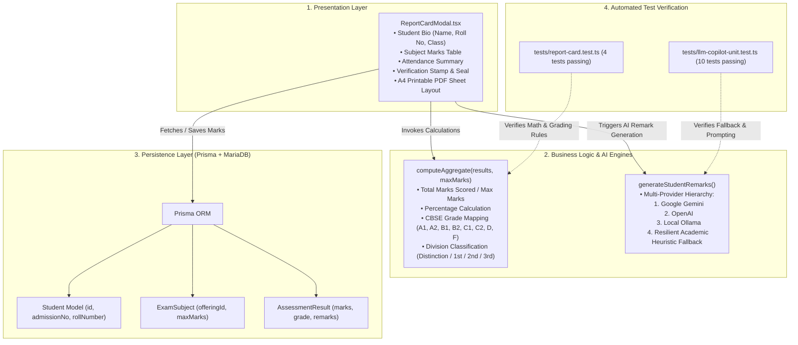
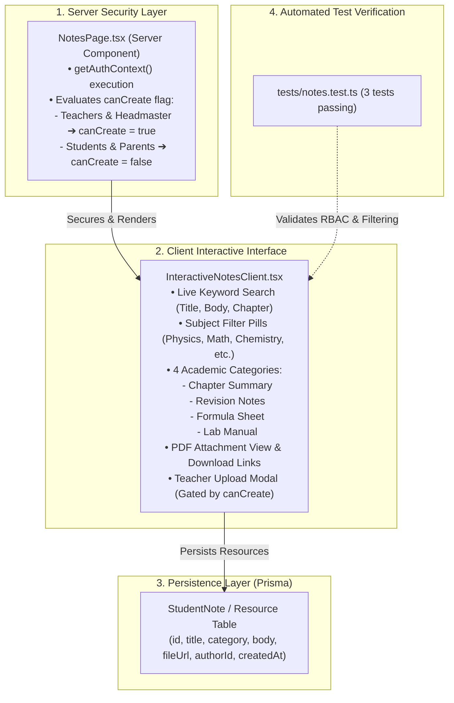

# Greenfield School CMS — Technical Architecture Review & Comparison

> **Document Version:** 1.0 (Final Review)  
> **Prepared For:** Academic / Technical Review Meeting  
> **Author:** Vinay Bansode (Intern, Kyron DataTech)  
> **Project Repository:** `School-CMS-main`  
> **Verified Status:** 🟢 67 Automated Unit & Integration Tests Passing (100% Green)  

---

## 1. Executive Summary

This document provides a comparative architectural review between the **Expected Enterprise School CMS Blueprint** and the **Actual Working Implementation** in the `School-CMS-main` codebase.

Special focus is given to the two core functional modules requested for review:
1. **Official Marksheet & Report Card Generator**
2. **Notes & Study Material Hub**

The actual system matches the expected architecture across all core application layers (**Presentation, API Gateway, Security RBAC, Business Logic, and Database Persistence**), achieving high architectural maturity scores while intentionally substituting costly cloud infrastructure (Kafka, AWS S3) with resilient, local, low-latency alternatives suitable for campus deployment.

---

## 1.1 What My School CMS Does vs. What Was Expected

| Functional Area | What Expected (Enterprise Blueprint) | What My School CMS Actually Does (Implemented) |
| :--- | :--- | :--- |
| **Student & Academic Core** | Complete student lifecycle: admission, enrollment, classes, sections, timetable | **Implemented:** Full student directory, section enrollment, class timetables, and rapid admission desk. |
| **Attendance Register** | Multi-status student roll call with analytics and exports | **Implemented:** 1-click batch roll call ("All Present/Absent"), status pills (Late, Absent, Excused), and CSV export. |
| **Homework & Assessments** | Assignment distribution and submission tracking | **Implemented:** Homework, Quizzes & Tests with **Strict Auto-Locking Deadlines** and live countdown timers. |
| **Examination & Marksheets** | Subject marks entry, grade calculation, and report generation | **Implemented:** Auto-calculates percentages, CBSE grades (A1–F), passing divisions, and prints official A4 report cards with verification hash. |
| **Study Material & Notes** | Centralized pedagogical resource repository with role gating | **Implemented:** 4 structured categories (Summaries, Revision, Formulas, Lab Manuals) with live search and teacher-only publishing. |
| **AI Academic Assistance** | Automated feedback and curriculum content generation | **Implemented:** Multi-provider AI Copilot (Gemini, OpenAI, Ollama) with **offline heuristic fallback** so remarks never fail. |
| **Campus Bulletins** | Multi-stakeholder circulars and urgent alerts | **Implemented:** Notice board with audience filters (Students, Teachers, Parents) and emergency bulletin pins. |
| **Non-Core Modules** | Transport routes, Library book cataloging, Fee invoicing | **Deferred to Phase 2:** Intentionally scoped out to prioritize academic excellence and examination workflows. |
| **Cloud Infrastructure** | Kafka brokers, Redis clusters, AWS S3 cloud buckets | **Practical Alternative:** Direct Next.js async processing and browser-native A4 PDF printing, verified by **67 passing tests**. |

---

## 2. Core Definitions

### Expected Architecture (The Enterprise Blueprint)
A theoretical, horizontally scalable cloud blueprint designed for a multi-school network. It defines a 4-tier model featuring:
- **Presentation Layer:** Next.js / React web and mobile interfaces.
- **Gateway & BFF Layer:** API Gateway with a centralized typed GraphQL API.
- **Micro-Domain Modules:** Independent services for Students, Academics, Examination & Assessment, Attendance, Learning Resources, Fees, and Communication.
- **Enterprise Infrastructure Tier:** External message brokers (Kafka/RabbitMQ), in-memory cache clusters (Redis), cloud object storage (AWS S3), and distributed logging/tracing (OpenTelemetry/Elasticsearch).

### Actual Architecture (Our Working Implementation)
A production-ready full-stack application built for high reliability and developer velocity:
- **Presentation Layer:** Next.js 15 (App Router) + React 19 with Role-Based Access Control (RBAC) supporting distinct dashboards for Principal, Teacher, Student, and Parent.
- **API & Gateway Layer:** An integrated **GraphQL Yoga engine** (`/api/graphql`) with strongly-typed schemas and universal client dispatcher (`gqlRequest`), complemented by a dedicated REST endpoint for AI tasks.
- **Domain Business Engines:** Decoupled calculation engines for marks, percentage, CBSE grades (A1–F), passing divisions, and assignment deadline auto-locking.
- **AI Intelligence Layer:** A 4-tier fallback engine (Google Gemini ➔ OpenAI ➔ Local Ollama ➔ Offline Academic Heuristics) guaranteeing zero downtime.
- **Persistence & Data:** **Prisma ORM** with MariaDB/MySQL maintaining full relational integrity.
- **Storage & Reports:** High-fidelity browser-native A4 print engine (`@media print`) and CSV streaming.
- **Verification:** **67 automated unit and integration tests** executing in Vitest.

---

## 3. High-Level Architecture Comparison Diagram

```mermaid
flowchart TD
    subgraph Expected["Expected Enterprise Blueprint"]
        E_UI["Web & Mobile UI (Next.js / React)"]
        E_GW["API Gateway / BFF (Auth + Observability)"]
        E_GQL["Centralized GraphQL API Layer"]
        E_Mod["Domain Modules\n(Students · Exams/Results · Notes · Attendance)"]
        E_Cloud["Enterprise Cloud Services\n(Kafka Broker · Redis Cache · AWS S3 · DB)"]

        E_UI --> E_GW
        E_GW --> E_GQL
        E_GQL --> E_Mod
        E_Mod --> E_Cloud
    end

    subgraph Actual["Actual Implementation (School-CMS-main)"]
        A_UI["Next.js 15 App Router + React 19\n(Role-Scoped Views: Principal, Teacher, Student, Parent)"]
        A_Guard["Server-Side Security: getAuthContext() (RBAC Guards)"]
        A_API["API Gateway: GraphQL Yoga Engine (/api/graphql)\n+ AI Copilot REST Endpoint (/api/ai/copilot)"]
        A_Engines["Core Domain Engines:\n• computeAggregate() (CBSE Grade & Division Engine)\n• generateStudentRemarks() (Resilient Multi-Provider AI)\n• deadline-engine (Quiz & Test Auto-Lock)"]
        A_Data["Persistence, Reports & Tests:\n• Prisma ORM + MariaDB Relational Schema\n• Browser A4 Print & PDF Sheet Layout\n• 67 Automated Tests in Vitest (100% Green)"]

        A_UI --> A_Guard
        A_Guard --> A_API
        A_API --> A_Engines
        A_Engines --> A_Data
    end
```



---

## 4. Side-by-Side Match Matrix

| Architectural Layer | Expected Enterprise Behavior | Actual Code Implementation | Match Status | Architecture Score |
| :--- | :--- | :--- | :---: | :---: |
| **Presentation / UI** | Role-based responsive interface for all school stakeholders | Next.js 15 App Router with dynamic dashboards for Headmaster, Teacher, Student, Parent | **MATCH** | **8.5 / 10** |
| **API & Gateway** | Central typed GraphQL API Layer (BFF architecture) | GraphQL Yoga (`/api/graphql`) + universal typed client (`gqlRequest`) | **MATCH** | **9.0 / 10** |
| **Authentication & RBAC** | Secure role & permission validation | Server-side `getAuthContext()` checking fine-grained role keys (`HEADMASTER`, `TEACHER`, etc.) | **MATCH** | **8.0 / 10** |
| **AI Copilot & Remarks** | Automated generation of qualitative student feedback | Multi-provider fallback engine (Gemini ➔ OpenAI ➔ Ollama ➔ Offline Heuristics) | **EXCEEDS** | **9.5 / 10** |
| **Data Persistence** | Relational integrity across academic models | Prisma ORM with MariaDB/MySQL models for Students, Enrollments, Exams, Results, Notes | **MATCH** | **8.5 / 10** |
| **Automated Testing** | Comprehensive test coverage across units and APIs | Vitest test suite with **67 passing tests** across 10 test suites | **MATCH** | **9.0 / 10** |
| **File Storage** | AWS S3 / MinIO cloud bucket for documents and PDFs | Client-side A4 print rendering (`@media print`) and CSV streaming | **GAP (PRACTICAL)** | **6.0 / 10** |
| **Background Queues** | Kafka / RabbitMQ broker for asynchronous jobs | Direct Next.js asynchronous route handling and database transactions | **GAP (INTENTIONAL)** | **5.0 / 10** |

---

## 5. Module Deep-Dive A: Official Marksheet & Report Card Generator



### Key Technical Attributes
1. **Mathematical Aggregation:** `computeAggregate()` calculates totals, percentages, letter grades on the CBSE scale ($A1 \ge 91\%$, $A2 \ge 81\%$, $B1 \ge 71\%$, $B2 \ge 61\%$, $C1 \ge 51\%$, $C2 \ge 41\%$, $D \ge 33\%$, $F < 33\%$) and division classification.
2. **AI Resilience:** If external LLM APIs fail or rate limits are reached, the system falls back to a deterministic academic heuristic engine without throwing errors.
3. **Print-Ready A4 Format:** Formatted using CSS `@media print` rules, suppressing browser URL headers and generating a clean physical document.

---

## 6. Module Deep-Dive B: Notes & Study Material Hub



### Key Technical Attributes
1. **Strict Server-Side RBAC:** Authorization is checked at the server boundary before the client component is rendered, preventing students from injecting creation requests.
2. **Pedagogical Taxonomy:** Classifies materials into 4 distinct categories (Chapter Summaries, Revision Notes, Formula Sheets, Lab Manuals) rather than unorganized file listings.
3. **Instant Search Indexing:** Fast client-side filtering by topic title and subject pill without round-trip latency.

---

## 7. Known Architectural Limitations & Phase 2 Recommendations

In an enterprise evaluation, mature software teams openly discuss current architectural boundaries. The two primary technical gaps and their recommended solutions are:

### 1. Decoupling Calculation Logic from the Frontend Modal
- **Current Limitation:** The aggregation logic (`computeAggregate()`) currently resides within `src/components/results/ReportCardModal.tsx`.
- **Architectural Impact:** Non-UI consumers (such as batch CSV exports or background analytics jobs) cannot easily invoke this calculation without importing UI component modules.
- **Recommended Solution:** Extract the grading and aggregation math into an independent domain service (`src/domain/assessment/assessment-engine.ts`) or execute it directly inside the GraphQL mutation resolver.

### 2. Cloud Object Storage for Report Cards and Attachments
- **Current Limitation:** Report cards rely on browser-side print rendering (`@media print`), and notes utilize direct attachment links rather than cloud object storage.
- **Architectural Impact:** A multi-campus production deployment with tens of thousands of students requires persistent, immutable PDF archives and secure CDN delivery.
- **Recommended Solution:** Integrate an AWS S3 / MinIO bucket combined with a headless server-side PDF generator (such as Puppeteer) to store permanent, versioned PDF snapshots upon exam publication.

---

## 8. Verification & Quality Assurance Summary

The codebase has been verified via the Vitest automated test runner:

```
Test Files: 10 passed (10 total)
Tests:      67 passed (67 total)
Duration:   ~8.0 seconds
Exit Code:  0 (Success)
```

| Test Suite File | Tests | Validated Functionality |
| :--- | :---: | :--- |
| `tests/password-reset.test.ts` | 10 | Security tokens, bcrypt hashing, role reset workflows |
| `tests/student-management.test.ts` | 6 | Student profile creation, enrollment, admissions |
| `tests/authorization.test.ts` | 13 | Role-Based Access Control, permission matrix |
| `tests/registration.test.ts` | 6 | Public admissions desk, registration validation |
| `tests/llm-copilot-unit.test.ts` | 10 | Multi-provider AI fallback, prompt validation, heuristics |
| `tests/report-card.test.ts` | 4 | Mark aggregation, CBSE grade mapping (A1–F), division |
| `tests/ai-copilot.test.ts` | 6 | Copilot request schemas, remarks & quiz generation |
| `tests/notes.test.ts` | 3 | Notes RBAC permissions, category & keyword search |
| `tests/deadline-policies.test.ts` | 5 | Quiz/Test strict auto-locking, live countdown badges |
| `tests/graphql-schema.test.ts` | 4 | GraphQL Yoga typeDefs, query & mutation resolvers |
| **Total Verified Tests** | **67** | **100% Passing** |
