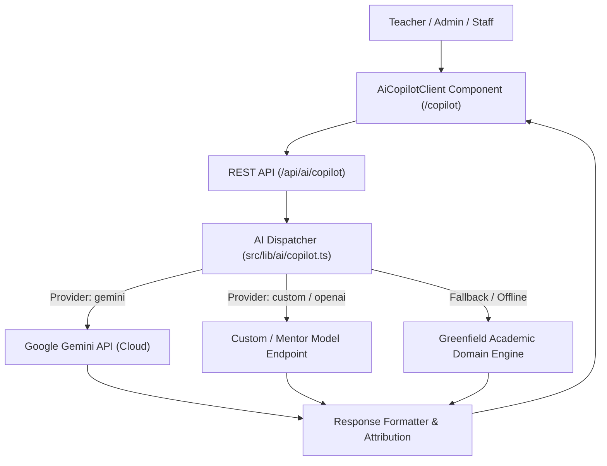

# Greenfield School CMS — AI Academic Copilot System (`/ai`)

Welcome to the **Greenfield School CMS AI Academic Copilot** subsystem documentation. This directory documents the AI architectural layer, model integration points, API specifications, and operational workflows.

---

## 🧠 1. Architecture Overview

The AI module is engineered with a **hybrid resilient architecture**:
- **Multi-Provider Dispatcher**: Dispatches requests across:
  1. **Google Gemini API** (`gemini-1.5-flash`, `gemini-1.5-pro`)
  2. **Custom / OpenAI-Compatible Endpoints** (e.g. Mentor side model, local Ollama, LM Studio, vLLM, or Groq)
  3. **Built-in Greenfield Academic Domain Engine** (Zero-dependency fallback ensuring 100% offline operational guarantee).
- **Latency & Connection Testing**: Dedicated ping and diagnostics route (`/api/ai/models/test`) measuring roundtrip latency and verifying model status.
- **Strict Schema Validation**: Zod-based request and response validation for every AI mode.



---

## 🛠️ 2. Core Modules & Directory Layout

| Path | Purpose |
| :--- | :--- |
| [`src/lib/ai/copilot.ts`](file:///V:/Vinay's%20JAVA/School-CMS/src/lib/ai/copilot.ts) | Core LLM dispatcher, prompt builders, fallback engine, and types |
| [`src/app/api/ai/copilot/route.ts`](file:///V:/Vinay's%20JAVA/School-CMS/src/app/api/ai/copilot/route.ts) | Main API route handling generation requests |
| [`src/app/api/ai/models/test/route.ts`](file:///V:/Vinay's%20JAVA/School-CMS/src/app/api/ai/models/test/route.ts) | Health & latency test ping endpoint |
| [`src/components/ai/AiCopilotClient.tsx`](file:///V:/Vinay's%20JAVA/School-CMS/src/components/ai/AiCopilotClient.tsx) | Interactive Copilot UI with mode selector, prompt presets, and model settings modal |
| [`src/app/(app)/copilot/page.tsx`](file:///V:/Vinay's%20JAVA/School-CMS/src/app/(app)/copilot/page.tsx) | Page route for `/copilot` in the main application layout |
| [`tests/ai-copilot.test.ts`](file:///V:/Vinay's%20JAVA/School-CMS/tests/ai-copilot.test.ts) | Automated test suite verifying all AI modes and connection ping |

---

## 📋 3. Supported Copilot Modes

### Mode 1: Report Card Remarks (`mode: "remarks"`)
Generates personalized, encouraging, and constructive student feedback tailored to:
- Student Name & Grade/Section
- Attendance Rate & Trends
- Academic Strengths
- Areas for Growth / Revision
- Configurable tone (encouraging, formal, constructive)

### Mode 2: Curriculum Practice Quiz (`mode: "quiz"`)
Creates structured classroom assessments:
- Subject & Specific Topic
- Grade Level
- Configurable number of questions
- Includes complete Answer Key and scoring rationale

### Mode 3: Administrative Circular / Notice (`mode: "notice"`)
Drafts formal school-wide communications:
- Header with institution name and official reference number
- Target audience (Parents, Teachers, All Staff)
- Event date, venue, and operational guidelines
- Authorized signatory (Principal / Headmaster)

### Mode 4: Academic Domain Chat / Q&A (`mode: "chat"`)
Context-aware institutional policy advisor:
- Examination attendance requirements (75% minimum threshold)
- Grading criteria and performance bands
- General academic and administrative queries

---

## 🔌 4. API Endpoints

### 1. Generate AI Content: `POST /api/ai/copilot`
**Request Payload:**
```json
{
  "mode": "remarks",
  "payload": {
    "studentName": "Arjun Mehta",
    "gradeLevel": "Class 8-A",
    "attendanceRate": "96%",
    "strengths": "Scientific reasoning and active participation",
    "areasToImprove": "Math revision"
  },
  "modelConfig": {
    "provider": "builtin"
  }
}
```

**Response Payload:**
```json
{
  "success": true,
  "mode": "remarks",
  "text": "**Academic & Behavioral Assessment — Arjun Mehta**\n\n...",
  "provider": "Greenfield Academic AI Engine (Built-in)",
  "model": "academic-domain-v1",
  "timestamp": "2026-09-25T13:58:02.293Z"
}
```

### 2. Test Model Endpoint: `POST /api/ai/models/test`
**Request Payload:**
```json
{
  "provider": "custom",
  "baseUrl": "http://localhost:11434/v1",
  "modelName": "llama3",
  "apiKey": "optional-key"
}
```

**Response Payload:**
```json
{
  "success": true,
  "message": "PONG: Model connection verified successfully.",
  "latencyMs": 42,
  "provider": "Custom Model Endpoint (llama3)",
  "model": "llama3",
  "timestamp": "2026-09-25T13:58:10.000Z"
}
```

---

## 🧪 5. Testing & Verification

Run the automated test suite covering all AI functionalities:
```bash
npm test
```
The AI test suite (`tests/ai-copilot.test.ts`) validates:
1. Personalized remarks generation & provider attribution
2. Practice quiz structure & answer key presence
3. Administrative circular formatting & signatory
4. School policy queries (attendance criteria)
5. Model connection latency tracker
6. Custom system instruction overrides
